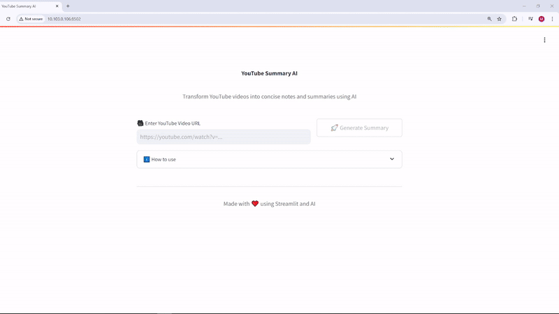

title: Youtube Summary Ai
emoji: 🎥
colorFrom: pink
colorTo: red
sdk: streamlit
sdk_version: 1.42.0
app_file: app.py
pinned: false

# YouTube Summary AI

Transform YouTube videos into concise notes and summaries using fully local AI processing. This application runs entirely on your machine with no external API calls, ensuring complete privacy and security of your data.



## Key Features

- 🔒 **100% Local Processing**: All AI operations run on your machine
  - No API keys required
  - No data sent to external servers
  - Complete privacy and security
  - Use CPU or GPU to run the AI
- 🎯 **Offline Capable**: Once models are downloaded, works without internet
- ⚡ **Fast Processing**: Direct local inference without API latency
- 🎥 Easy YouTube video URL input
- 🔊 Advanced audio extraction using yt-dlp
- 📝 Local transcription using Whisper
- 🤖 Local AI summarization using LLaMA, Gemma or others LLM 
- 🌐 Shareable summary links
- 💻 Clean and intuitive user interface

## How It Works

1. **Download**: Downloads YouTube video audio locally using yt-dlp
2. **Transcribe**: Processes audio using local Whisper model
3. **Summarize**: Generates summary using local LLaMA model
4. **All data stays on your machine!**

## Prerequisites

Before running the application, make sure you have the following installed:
- Python 3.8 or higher
- FFmpeg
- Ollama with LLaMA model

## Installation

1. Clone the repository
```bash
git clone https://github.com/Shivp1413/youtube-summary-ai.git
cd youtube-summary-ai
```

2. Create a virtual environment (recommended)
```bash
python -m venv venv
source venv/bin/activate  # On Windows, use: venv\Scripts\activate
```

3. Install the required packages
```bash
pip install -r requirements.txt
```

4. Install and run Ollama with LLaMA model
```bash
# Install Ollama from https://ollama.ai
ollama pull llama3.1
```

## First-Time Setup

When you first run the application, it will:
1. Download the Whisper base model (~150MB) for local transcription
2. Use your local LLaMA model for summarization
3. All subsequent runs will use these local models

## Usage

1. Start the Streamlit application:
```bash
streamlit run app.py
```

2. Open your web browser and navigate to `http://localhost:8501`

3. Enter a YouTube URL and click "Generate Summary"

4. Share the summary using the generated link

## Project Structure

```
youtube-summary-ai/
├── app.py              # Main Streamlit application
├── summarizer.py       # Video processing and local AI logic
├── requirements.txt    # Project dependencies
├── assets/            # Project assets
│   └── demo.gif       # Application demo
└── README.md          # Project documentation
```

## Security Features

- ✅ No API keys needed
- ✅ No cloud services required
- ✅ All processing happens locally
- ✅ No data leaves your machine
- ✅ Full control over your data
- ✅ Works offline after initial setup

## Contributing

Contributions are welcome! Please feel free to submit a Pull Request. 

## License

This project is licensed under the MIT License - see the [LICENSE](LICENSE) file for details.
